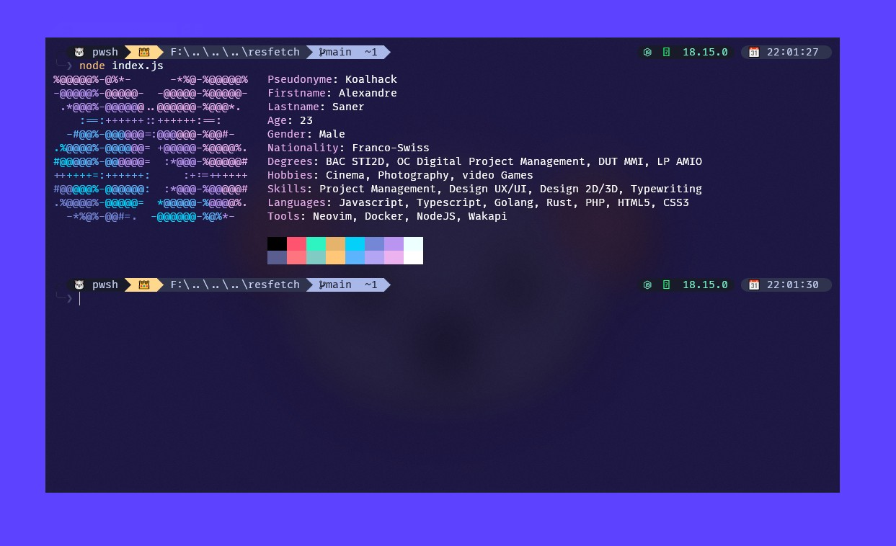

<h1 align="center">Resfetch</h1>

<p align="center">Resfetch is a small terminal tool for displaying your resume in a <a href="https://github.com/dylanaraps/neofetch">neofetch</a>  style.</p>

## Installation

> You need to execute this code [node.js](https://nodejs.org)

```bash
git clone https://github.com/Koalhack/resfetch.git
```

```bash
cd resfetch
```

```bash
npm install
```

## Usage

### Define resume Logo

Edit `Data/logo.yml` file for a custom logo

```yaml
logo:
  - { text: ['%@@@@@%-@%*-      -*%@-%@@@@@%'], color: ['cyanBright'] }
  - {
      text: ['-@@@@@%', '-@@@@@-  -@@@@@-%@@@@@-'],
      color: ['cyan', 'cyanBright']
    }
```

- Each line represent a line of your log
- You can specify a custom color for each line or section of line (separated by `,`)
- Each color are specified in the same order of section of you logo
- The current supported color is ('black','red','green','yellow','blue','magenta','cyan','white','blackBright','redBright','greenBright','yellowBright','blueBright','magentaBright','cyanBright','whiteBright')

> TIP - you can create easily a ASCII logo with the CLI [Fliget](http://www.figlet.org) tool or by using a [online](https://patorjk.com/software/taag/#p=display&f=Graffiti&t=Type%20Something%20) version

### Define resume informations

Edit `Data/infos.yml` file for a custom informations

In this file you can just change the existing informations by new one or add new informations type

#### Change default informations

Edit the text between quotation marks or number

**Example :**

FROM

```yaml
Firstname: 'Elon'
Lastname: 'Musk'
Age: 50
```

TO

```yaml
Firstname: 'Alexandre'
Lastname: 'Saner'
Age: 23
```

#### Add new informations type

**Example :**

FROM

```yaml
Firstname: 'Elon'
Lastname: 'Musk'
Age: 50
```

TO

```yaml
Firstname: 'Elon'
Lastname: 'Musk'
Age: 50
Hobbies:
  - 'Cinema'
  - 'Photography'
  - 'video Games'
```

### Run Script

In your terminal and in the `resfetch` folder run this command

```bash
node index.js
```
